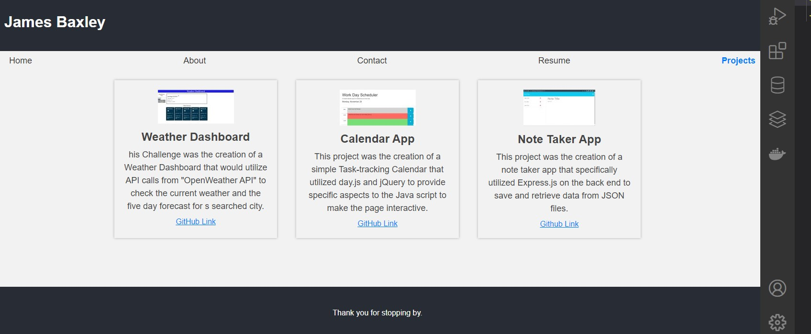

# ch20_baxley_portfolio_2

## Table of Contents:

- [Description](#description)
- [Acceptance Criteria](#acceptance-criteria)
- [Installation](#installation)
- [Usage](#usage)
- [Contribution](#contribution)
- [Testing](#testing)
- [Credits](#credits)
- [License](#license)

## Description

This project was the creation of Portfolio using Front End React features. The Application utilizes React, Javascript, and bootstrap to render a interactive portfolio page for Projects created. The Projects page links to the github of each specific project and allows a user to view a variety of complete works.

## Acceptance Criteria

GIVEN a single-page application portfolio for a web developer<br?>
WHEN I load the portfolio<br?>
THEN I am presented with a page containing a header, a section for content, and a footer<br?>
WHEN I view the header<br?>
THEN I am presented with the developer's name and navigation with titles corresponding to different sections of the portfolio<br?>
WHEN I view the navigation titles<br?>
THEN I am presented with the titles About Me, Portfolio, Contact, and Resume, and the title corresponding to the current section is highlighted<br?>
WHEN I click on a navigation title<br?>
THEN I am presented with the corresponding section below the navigation without the page reloading and that title is highlighted<br?>
WHEN I load the portfolio the first time<br?>
THEN the About Me title and section are selected by default<br?>
WHEN I am presented with the About Me section<br?>
THEN I see a recent photo or avatar of the developer and a short bio about them<br?>
WHEN I am presented with the Portfolio section<br?>
THEN I see titled images of six of the developer’s applications with links to both the deployed applications and the corresponding GitHub repository<br?>
WHEN I am presented with the Contact section<br?>
THEN I see a contact form with fields for a name, an email address, and a message<br?>
WHEN I move my cursor out of one of the form fields without entering text<br?>
THEN I receive a notification that this field is required<br?>
WHEN I enter text into the email address field<br?>
THEN I receive a notification if I have entered an invalid email address<br?>
WHEN I am presented with the Resume section<br?>
THEN I see a link to a downloadable resume and a list of the developer’s proficiencies<br?>
WHEN I view the footer<br?>
THEN I am presented with text or icon links to the developer’s GitHub and LinkedIn profiles, and their profile on a third platform (Stack Overflow, Twitter)<br?>

## Installation

The user will simply need to run <b> npm i</b> to instal the models for the package.json and then run <b>npm start</b> to view the project on the local server.

## Usage

The user will access the application via gitHub pages and be able to view a life version of the application. The user will utilize the navigation page to traverse the different pages and view all aspects of the Portfolio.

## Contribution

N/A

## Testing

No testing was utilized for this project

## Credits

### Team Members:

- James Baxley | Github: [Kaneknah](https://github.com/Kaneknah)

### Technologies utilized:

- React
- Express.js
- bootstrap
- JavaScript

### GitHub Link: <https://github.com/Kaneknah/ch20_baxley_portfolio_2/settings/pages>

### Github Live Link: <https://kaneknah.github.io/ch20_baxley_portfolio_2/>

## License

Apache License 2.0
...
